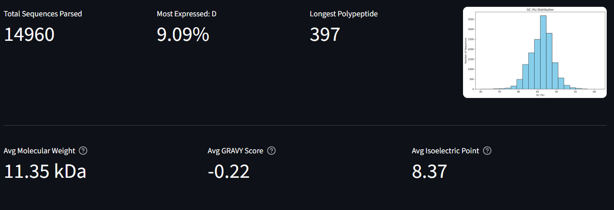
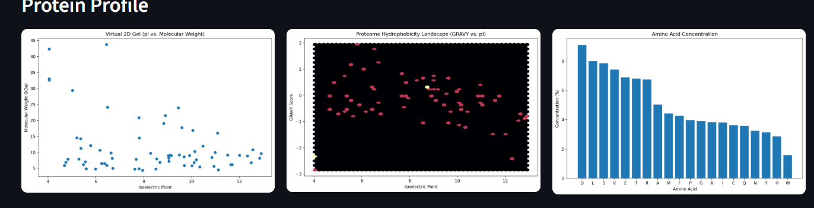

## GENOMIC FASTA FILE PROCESSOR

A highly optimised genomic processor that takes in raw fasta files and outputs a report on amino acid concentration, Virtual 2D Gel, Proteome Hydrophobicity Landscape and outputs an protein summary. Parameters can be set dynamically as well as the translation table can be set when dealing with different organism types 

 

 

## Features
- **Sequence Statistics**: Calculates GC content, sequence length, and nucleotide distribution, .
- **Validation**: Ensures FASTA files follow standard formatting rules.
- **Batch Processing**: Capable of handling multi-record FASTA files efficiently.
- **Export Options**: Generates protein summary reports in CSV formats.

## Installation

1. Clone the repository:
   ```bash
   git clone https://github.com/Chadwithcrack-code/DNA-report-processor.git
   ```
2. For installation you can pip install uv and run 'uv sync' in the command line.

3. Website link: 

## Usage
    Upload your fasta file and wait for the report to generate (takes < 1 minute), you can change the parameters to encompass what you looking for and more parameters will be added in future updates
    Lastly you can export the protein profile by clicking download right at the bottom of the website

## Notes:
    If any bugs are found push requests are welcomed
